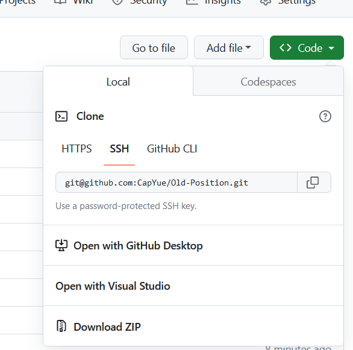

## 向GitHub远程仓库提交文件的两种方式：

### Github存在仓库，需要拉到本地，修改再提交

```C++
git clone ssh
```



git bush中的粘贴按键为 shift + insert

使用git clont拉到本地的仓库，已经完成了仓库的初始化，也完成了远程仓库的关联。下一步

1.添加文件

首先在windows文件夹中添加需要增加的文件，例如a.md

然后：

```c++
添加文件到暂存区
提交文件
将文件提交给远程仓库
```

指令如下：

```C++
	git add a.md
	git commit -m '添加文件'
    git push -u origin master
```

2.修改单个文件

例如修改了文件b.md则需要：

```makefile
提交修改文件到暂存区 add
提交修改文件
push到远程仓库
```

```c++
	git add b.md
    git commit -m '修改文件'
    git push -u origin master
```

3.修改添加了很多文件时

使用 git status查看状态如下：


有修改，有删除，有还未track的

故直接使用

```c++
git add .
```

添加所有文件


可以看到刚才所有变动都可以commit了

后面

```make
git commit -m '整体提交'
git push -u origin master
```

