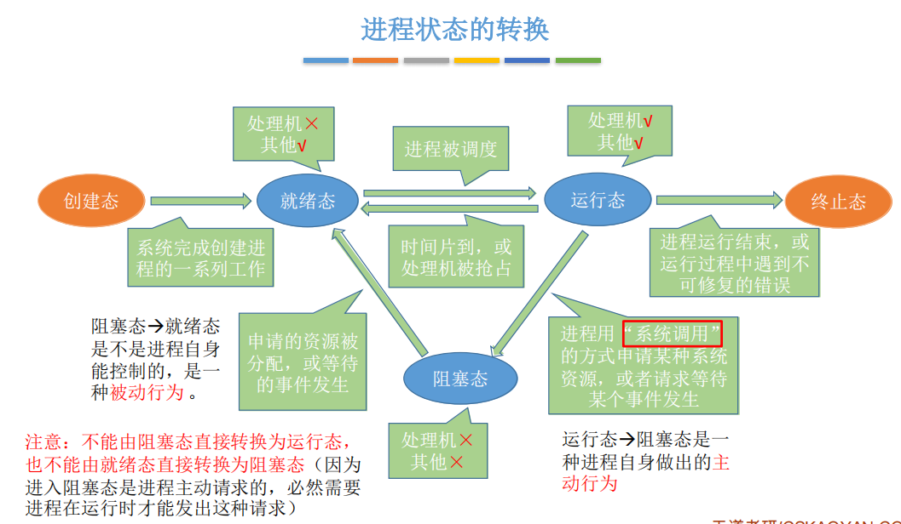
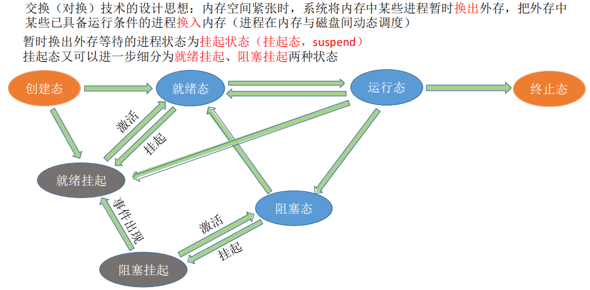

##### 进程与线程的区别？

- 进程是操作系统资源调度与分配的单位，为了实现系统的高并发，而线程是CPU资源调度与分配的基本单位，也是为了实现高并发。
- 资源方面，进程有独立的内存空间，而线程的是共享内存，公用打印机I/O口 cpu等资源。
- 性能与开销方面：进程的开销大，切换速度慢，线程开销较小，且由于是共享内存，切换速度快，性能好。
- 进程间互不影响，而一个线程崩溃了可能一整个进程也无法运行下去了。

##### 为什么有线程？

进程的开销是巨大的,操作系统需要一个开销更小,切换更快,粒度更小的机制,作为CPU调度的基本单位,所以有了线程.

##### 常见的Linux命令

pwd:用于显示工作目录

cd:切换当前目录

ls:查看当前文件与目录

cp:赋值

rm:删除文件或文件夹

tar:调用gzip/bzip对文件进行压缩

##### LinuxGDB调试

quit:退出gdb，结束调试

list:显示源代码

run:程序执行

break:设置断点

break 7：在第七行设置断点

**条件断点：**break if 条件 以条件表达式设置断点

**多进程下如何调试：**用set follow-fork-mode child 调试子进程

​                或者set follow-fork-mode parent 调试父进程

##### 大端小端是什么，如何判断大端小端

举一个例子，比如数字0x12 34 56 78在内存中的表示形式。

**1)大端模式：Big-Endian就是高位字节排放在内存的低地址端，低位字节排放在内存的高地址端。** 大端模式比较符合人的阅读习惯。

低地址 --------------------> 高地址
0x12  |  0x34  |  0x56  |  0x78

**2)小端模式：Little-Endian就是低位字节排放在内存的低地址端，高位字节排放在内存的高地址端。**

低地址 --------------------> 高地址
0x78  |  0x56  |  0x34  |  0x12

如何判断大端模式还是小端模式：

```c++
bool checkBig(){//判断是否为大端
    union test{
        int a;
        char b
    }
    test t;t.a=1;
    return(t.b!=1);//
}
```

union 联合体是共用内存区域，也就是说int 和 char一起公用4byte.并且union一定是从**低地址**开始存放，所以char a对应最低内存区域，只要判断b是否为1即可。如果是大端存储，int的1是低位存在最高位，b!=1返回true；小端存储时1存在最低位，t.b==0返回false；

##### 大端小端的优缺点？

TCP/IP协议规定为大端模式，为了网络通讯，还专门出了网络字节序与主机字节序之间的转换接口（ntohs、htons、ntohl、htonl）。

大端小端各有各的优缺点：计算都是从低位到高位的，故计算机内部计算的化小端排序会更有效率。大端排序符号位在前，更容易判断符号。另外大端排序符合人类的阅读习惯。

##### 僵尸进程

正常情况：一个父进程使用fock()创建一个子进程，子进程继续创建子进程，但是**父进程的运行**与**子进程的结束**是异步的，父进程无法预知子进程何时结束，于是unix系统提供一个机制：当子进程结束时，内核会释放其所占有的资源，但是会保留其状态信息直到父进程通过wait()/waitpid()来判断其状态以后才会释放。

保存的信息：

1进程号the process ID

2退出状态the termination status of the process

3运行时间the amount of CPU time taken by the process等

**孤儿进程：**

父进程退出之后，还未结束的子进程就是孤儿进程，他们会被**init进程**收养，对他们完成状态收集工作。

僵尸进程：就是子进程结束之后，父进程调用wait()/waitpid()之前子进程所处的状态。正常进程下子进程也会经历僵尸进程状态。

如果父进程未使用wait()或waitpid()就退出了，子进程的PS就会显示z。

如果父进程在子进程结束之前退出了，则有init进程就会变成这些孤儿进程的父进程。

危害：如果大量子进程处于僵尸态，那么回到是无法创建新进程的情况。

**解决方法：**

外部解决：通过**kill**发送**SIGTERM**或者**SIGKILL**信号消灭产生僵尸进程的进程，它产生的僵死进程就变成了孤儿进程，这些孤儿进程会被init进程接管，init进程会wait()这些孤儿进程，释放它们占用的系统进程表中的资源

内部解决：1、子进程退出时向父进程发送SIGCHILD信号，父进程处理SIGCHILD信号。在信号处理函数中调用wait进行处理僵尸进程。

2、fork两次，原理是将子进程成为孤儿进程，从而其的父进程变为init进程，通过init进程可以处理僵尸进程。

##### 用户态与内核态

用户态与内核态的权限不一样，内核态权限更高，可调用系统内核的数据。

**异常，中断，系统调用**会切换到内核态。

1、系统调用

这是用户进程主动要求切换到内核态的一种方式，用户进程通过系统调用申请操作系统提供的服务程序完成工作。而系统调用的机制其核心还是使用了操作系统为用户特别开放的一个中断来实现，例如Linux的ine 80h中断。

2、异常

当CPU在执行运行在用户态的程序时，发现了某些事件不可知的异常，这是会触发由当前运行进程切换到处理此。异常的内核相关程序中，也就到了内核态，比如缺页异常。

3、外围设备的中断

当外围设备完成用户请求的操作之后，会向CPU发出相应的中断信号，这时CPU会暂停执行下一条将要执行的指令，转而去执行中断信号的处理程序，如果先执行的指令是用户态下的程序，那么这个转换的过程自然也就发生了有用户态到内核态的切换。比如硬盘读写操作完成，系统会切换到硬盘读写的中断处理程序中执行后续操作等。

2）切换操作

从出发方式看，可以在认为存在前述3种不同的类型，但是从最终实际完成由用户态到内核态的切换操作上来说，涉及的关键步骤是完全一样的，没有任何区别，**都相当于执行了一个中断响应的过程**，因为系统调用实际上最终是中断机制实现的，而异常和中断处理机制基本上是一样的，用户态切换到内核态的步骤主要包括：

1、从当前进程的描述符中提取其内核栈的**ss0**及**esp0**信息。

2、使用ss0和esp0指向的内核栈将当前进程的cs,eip，eflags，ss,esp信息保存起来，这个过程也完成了由用户栈找到内核栈的切换过程，同时保存了被暂停执行的程序的下一条指令。

3、将先前由中断向量检索得到的中断处理程序的cs，eip信息装入相应的寄存器，开始执行中断处理程序，这时就转到了内核态的程序执行了。

总结：从当前进程描述符中提取内核栈的ss0以及esp0的信息，然后指向的内核将当前进程的信息保存起来，使用中断处理程序。


##### 协程

协程又称为微线程,看上去是**子程序,在其程序内部可以实现中断**，切换其他子程序，在适当的时候返回来继续执行。其与多线程相比最大的优势是:协程时内部子程序的切换,**没有切换线程的开销,**除此之外,它只有一个线程,不会涉及到多线程的锁机制,故其执行效率更高一些

1）概念：协程，又称微线程，纤程，英文名Coroutine。协程看上去也是子程序，但执行过程中，在子程序内部可中断，然后转而执行别的子程序，在适当的时候再返回来接着执行。

2）协程和线程区别那和多线程比，协程最大的优势就是协程极高的执行效率。因为子程序切换不是线程切换，而是由程序自身控制，因此，没有线程切换的开销，和多线程比，线程数量越多，协程的性能优势就越明显。

第二大优势就是不需要多线程的锁机制，因为只有一个线程，也不存在同时写变量冲突，在协程中控制共享资源不加锁，只需要判断状态就好了，所以执行效率比多线程高很多。

3）其他

在协程上利用多核CPU呢——多进程+协程，既充分利用多核，又充分发挥协程的高效率，可获得极高的性能。

Python对协程的支持还非常有限，用在generator中的yield可以一定程度上实现协程。虽然支持不完全，但已经可以发挥相当大的威力了。

##### 进程状态的切换



创建态,就绪态,调用,然后运行态,进程运行结束,或者运行过程中有不可修复的错误,就进入终止态,或者主动中断,等待某件事情的发生,**主动**进入阻塞态,然后进入等待队列,等到资源分配成功**被动**进入就绪态.

七参数模型:主要是为了,调入其他更加紧急的进程,加了了挂起状态,分为就绪挂起和阻塞挂起



##### 多线程和多进程适用场景

多线程模型适用于I/O密集型场景，因为I/O密集型场景因为I/O阻塞导致频繁切换，线程只占用栈，程序计数器，一组寄存器等少量资源，切换效率高，**单机多核分布式**；多进程模型适用于需要频繁的计算场景，多机分布式

##### 2.39 说说什么是死锁，产生的条件，如何解决？

**参考回答**

1. **死锁**: 是指多个进程在执行过程中，因争夺资源而造成了互相等待。此时系统产生了死锁。比如两只羊过独木桥，若两只羊互不相让，争着过桥，就产生死锁。

2. **产生的条件**：死锁发生有**四个必要条件**： 

   （1）**互斥条件**：进程对所分配到的资源不允许其他进程访问，若其他进程访问，只能等待，直到进程使用完成后释放该资源；

   （2）**请求保持条件**：进程获得一定资源后，又对其他资源发出请求，但该资源被其他进程占有，此时请求阻塞，而且该进程不会释放自己已经占有的资源；

   （3）**不可剥夺条件**：进程已获得的资源，只能自己释放，不可剥夺；

   （4）**环路等待条件**：若干进程之间形成一种头尾相接的循环等待资源关系。

3. **如何解决**：

   （1）资源一次性分配，从而解决请求保持的问题

   （2）可剥夺资源：当进程新的资源未得到满足时，释放已有的资源；

   （3）资源有序分配：资源按序号递增，进程请求按递增请求，释放则相反。

**答案解析**

举个例子，比如：如果此时有两个线程T1和T2，它们分别占有R1和R2资源

此时，T1请求R2资源的同时，T2请求R1资源。

这个时候T2说：你把R1给我，我就给你R2

T1说：不行，你要先给我R2，我才能给你R1

那么就这样，死锁产生了。如下图：


### 简述自旋锁和互斥锁的使用场景

**参考回答**

1. **互斥锁**用于临界区持锁时间比较长的操作，比如下面这些情况都可以考虑

（1）临界区有IO操作

（2）临界区代码复杂或者循环量大

（3）临界区竞争非常激烈

（4）单核处理器

1. **自旋锁就**主要用在临界区持锁时间非常短且CPU资源不紧张的情况下。

### 说说Linux进程调度算法及策略有哪些？

**参考回答**

1. 先来先服务调度算法
2. 短作业(进程)优先调度算法
3. 高优先级优先调度算法
4. 时间片轮转法
5. 多级反馈队列调度算法

**答案解析**

1. 先来先服务调度算法：每次调度都是从后备作业（进程）队列中选择一个或多个最先进入该队列的作业（进程），将它们调入内存，为它们分配资源、创建进程，然后放入就绪队列。
2. 短作业(进程)优先调度算法：短作业优先(SJF)的调度算法是从后备队列中选择一个或若干个估计运行时间最短的作业（进程），将它们调入内存运行。
3. 高优先级优先调度算法：当把该算法用于作业调度时，系统将从后备队列中选择若干个优先权最高的作业装入内存。当用于进程调度时，该算法是把**处理机**分配给就绪队列中优**先权最高的**进程
4. 时间片轮转法：每次调度时，把CPU 分配给队首进程，并令其执行一个时间片。时间片的大小从几ms 到几百ms。当执行的时间片用完时，由一个计时器发出时钟中断请求，调度程序便据此信号来停止该进程的执行，并将它送往就绪队列的末尾；然后，再把处理机分配给就绪队列中新的队首进程，同时也让它执行一个时间片。
5. 多级反馈队列调度算法：综合前面多种调度算法。

在这些调度算法中，有抢占式和非抢占式的区别。

1. 非抢占式优先权算法 在这种方式下，系统一旦把处理机分配给就绪队列中优先权最高的进程后，该进程便一直执行下去，直至完成；或因发生某事件使该进程放弃处理机时，系统方可再将处理机重新分配给另一优先权最高的进程。这种调度算法主要用于批处理系统中；也可用于某些对实时性要求不严的实时系统中。
2. 抢占式优先权调度算法 在这种方式下，系统同样是把处理机分配给优先权最高的进程，使之执行。但在其执行期间，只要又出现了另一个其优先权更高的进程，进程调度程序就立即停止当前进程(原优先权最高的进程)的执行，重新将处理机分配给新到的优先权最高的进程。因此，在采用这种调度算法时，是每当系统中出现一个新的就绪进程i 时，就将其优先权Pi与正在执行的进程j 的优先权Pj进行比较。如果Pi≤Pj，原进程Pj便继续执行；但如果是Pi>Pj，则立即停止Pj的执行，做进程切换，使i 进程投入执行。显然，这种抢占式的优先权调度算法能更好地满足紧迫作业的要求，故而常用于要求比较严格的实时系统中，以及对性能要求较高的批处理和分时系统中。

区别：

非抢占式（Nonpreemptive）：让进程运行直到结束或阻塞的调度方式，容易实现，适合专用系统，不适合通用系统。 抢占式（Preemptive）：允许将逻辑上可继续运行的在运行过程暂停的调度方式可防止单一进程长时间独占，CPU系统开销大（降低途径：硬件实现进程切换，或扩充主存以贮存大部分程序）