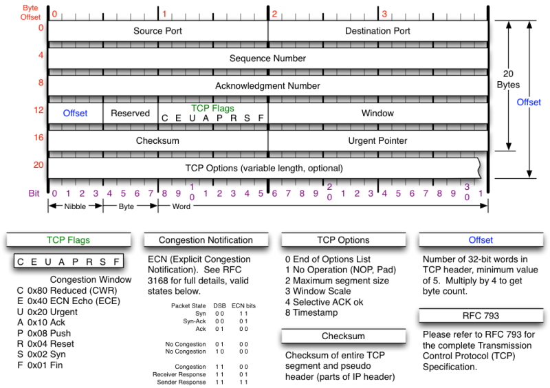

---

---

# 计算机网络

###### **OSI七层模型**

七层模型，亦称OSI（Open System Interconnection）。参考模型是国际标准化组织（ISO）制定的一个用于计算机或通信系统间互联的标准体系，一般称为OSI参考模型或七层模型。

**应用层**：协议有：HTTP FTP TFTP SMTP SNMP DNS TELNET HTTPS POP3 DHCP

**表示层**：数据的表示、安全、压缩。格式有，JPEG、ASCll、DECOIC、加密格式等

**会话层**：建立、管理、终止会话。对应主机进程，指本地主机与远程主机正在进行的会话

**传输层**：定义传输数据的协议端口号，以及流控和差错校验。协议有：TCP UDP，数据包一旦离开网卡即进入网络传输层

**网络层**：进行逻辑地址寻址，实现不同网络之间的路径选择。协议有：ICMP IGMP IP（IPV4 IPV6） ARP RARP

**数据链路层**：建立逻辑连接、进行硬件地址寻址、差错校验等功能。将比特组合成字节进而组合成帧，用MAC地址访问介质，错误发现但不能纠正。

**物理层**：建立、维护、断开物理连接。

​                                                                    七层模型

**认识TCP头的格式**

你需要注意这么几点：

- TCP的包是没有IP地址的，那是IP层上的事。但是有源端口和目标端口。(端口号可以确定从那个应用发出，发到哪个应用去)。
- 一个TCP连接需要四个元组来表示是同一个连接（src_ip, src_port, dst_ip, dst_port）准确说是五元组，还有一个是协议。但因为这里只是说TCP协议，所以，这里我只说四元组。例如有客户端简历链接（src_ip1,src_port1,dst_ip1,dst_port1）。
- 注意上图中的四个非常重要的东西：
  - **Sequence Number**是包的序号，在建⽴连接时由计算机⽣成的随机数作为其初始值，通过 SYN 包传给接收端主机，每发送⼀次数据，就 「累加」⼀次该「数据字节数」的⼤⼩。**用来解决网络包乱序（reordering）问题。**
  - **Acknowledgement Number**就是ACK——用于确认收到，指下⼀次「希望」收到的数据的序列号，发送端收到这个确认应答以后可以认为在这个序号以前的数据都已经被正常接收。**用来解决不丢包的问题**。
  - **Window又叫Advertised-Window**，也就是著名的滑动窗口（Sliding Window），**用于解决流控的**。
  - **TCP Flag** ，也就是包的类型，**主要是用于操控TCP的状态机的**。
  - **SYN**:TCP三次握手中，如果A是发起端，则A就对服务器发一个SYN报文。表示建立连接。该位为 1 时，表示希望建⽴连接，并在其「序列号」的字段进⾏序列号初始值的设定。
  - **ACK**：该位为 1 时，「确认应答」的字段变为有效，TCP 规定除了最初建⽴连接时的 SYN 包之外该位必须 设置为 1 。 
  - **RST**：该位为 1 时，表示 TCP 连接中出现异常必须强制断开连接。 
  -  **FIN**：该位为 1 时，表示今后不会再有数据发送，希望断开连接。当通信结束希望断开连接时，通信双⽅的主 机之间就可以相互交换 FIN 位为 1 的 TCP 段。**TCP四次挥手时，表示关闭连接**

###### **为什么需要TCP?**

因为**IP** 层是「不可靠」的，它不保证⽹络包的交付、不保证⽹络包的按序交付、也不保证⽹络包中的数据的完整性，**TCP**它能确保接收端接收的⽹络包是**⽆损坏**、**⽆间隔**、**⾮冗余** 和**按序**的。

###### **什么是TCP?**

TCP是一对一连接的、可靠的、基于字节流的通讯协议。

**一对一连接**：⼀定是「⼀对⼀」才能连接，不能像 UDP 协议可以⼀个主机同时向多个主机发送消息，也就是⼀ 对多是⽆法做到的；

**可靠的**：无论网络链路种出现了怎样的变化，总能保证一个**报文**总能**到达接收端**；

**字节流：**消息是无边无际的，无论分成多大都能传输，所以消息是按份儿传输的，但消息是有序的，故先收到后面的消息，也不能提前处理，遇到重复的报文要自动丢弃。

###### 什么是TCP链接？

简单来说就是，⽤于保证可靠性和流量控制维护的某些状态信息，这些信息的组合，包括**Socket**、**序列号**和**窗⼝⼤⼩**称为连接。

**建立一个TCP连接：**客户端与服务器互相确认以下三条信息，

1.**Socket**：由 **IP 地址**和**端⼝**号组成 

2.**序列号**：⽤来解决乱序问题等 

3.**窗⼝⼤⼩**：⽤来做流量控制

**确定唯一的TCP连接**：

TCP的四元数组可以确定唯一的TCP连接，（src_ip, src_port, dst_ip, dst_port）即（源地址，源端口，目的地址，目的端口）。    **源地址**和**⽬的地址**的字段（32位）是在 **IP 头部**中，作⽤是通过 IP 协议发送报⽂给**对⽅主机**。 

**源端⼝**和**⽬的端⼝**的字段（16位）是在 TCP 头部中，作⽤是告诉 TCP 协议应该把报⽂发给哪个**进程**。

###### 服务端最大并发数量理论与实际连接上线？

计算公式如下：

对于IPv4来说客户端的IP(32位)数量最多为2 的 32 次⽅，客户端的端⼝数最多为 2 的 16 次⽅，也就是服务端**单机最⼤ TCP 连接数**，约为 **2 的 48 次⽅**。

**实际情况**，由于：

1.⾸先主要是⽂件描述符限制，Socket 都是⽂件，所以⾸先要通过 ulimit 配置⽂件描述符的数⽬，是有限制的。

2.另⼀个是内存限制，每个 TCP 连接都要占⽤⼀定内存，操作系统的内存是有限的。

###### UDP与TCP分别在什么情况下使用？

**UDP特点**：UDP不提供复杂的控制机制，它利用IP提供面向”无连接“的通信服务，UDP协议简单UDP头如下所示：

**⽬标和源端⼝**：主要是告诉 UDP 协议应该把报⽂发给哪个进程。 

**包⻓度**：该字段保存了 UDP ⾸部的⻓度跟数据的⻓度之和。 

**校验和**：校验和是为了提供可靠的 UDP ⾸部和数据⽽设计。

**TCP与UDP的区别：**

1.连接

TCP需要先建立链接，UDP不需要链接。

2.服务对象

TCP是一对一的两点服务。UDP支持一对一、一对多、多对多服务。

3.可靠性

TCP是可靠交付数据的，UDP是尽可能可靠交付数据。

4.拥塞控制，流量控制

TCP具有这些功能，UDP不提供这些功能，即使网络拥堵了，也不会影响UDP的发送速率。

5.头部开销

TCP的开销更大，UDP的开销小，只有固定的八个字节。

6.传输方式

TCP是流传输，没有边界，但保证顺序和可靠。UDP是以包为单位发送，有边界，但肯能会丢包和乱序。

7.分片

TCP的数据大小如果大于MSS则会在传输层分片，如果中途丢失了重新传入这一片行，组装也是在接收端的传输成组装。

UDP的数据大小如果超过了MTU就会在IP层分片，目标接收到以后也是IP层组装。但是如果中途丢失了一片，需要整个重传，效率非常差。

**TCP与UDP使用场景**

TCP是一对一可靠连接故用于：

FTP文件传输

HTTP/HTTPS

UDP是广播传输，且处理速度快，但是丢片之后要重新传故用于：

包总量较少的通信，如DNS,SNMP等

视频、音频等多媒体 通信 .

广播通信

**TCP**

###### **TCP三次握手**

一开始，客户端与服务端都处于close()状态，然后服务端监听某个端口处于listen()状态。

第一次握手：是SYN报文，客户端会初始化序号(client_isn),然后会被置于TCP头部的序列号(segment)，并且SYN位置1，表示SYN报文。接着把第一个SYN报文发送给服务端，表示有连接意愿，之后客户端处于SYN-SENT状态，等待服务端响应。

第二次握手：服务端收到客户端的SYN报文后，初始化自己的序列号(server_isn)并赋值给TCP头的序列号字段中，然后ACK=client_isn+1,SYN=1，这就为SYN+ACK报文，然后发送给客户端，服务其为SYN-RCVD状态。

客户端收到服务端的报文之后，将ACK标志位置1，确认应答号置为server_isn+1，之后将TCP头加客户端要发送道服务端的data加上一同发到服务端，之后处于ESTABLISHED状态，服务端收到客户端应答报文之后也处于ESTABLISHED状态。

综上所述，三次握手前两次是不带数据的，第三次才开始带数据。一旦完成三次握手，双方都处于ESTABLISHED状态，之后客户端与服务端就可互相发送数据。

**三次握手总结**：

\1. Client将标志位SYN置为1，随机产生一个值seq=J，并将该数据包发送给Server，Client进入SYN_SENT状态，等待Server确认。

\2. Server收到数据包后由标志位SYN=1知道Client请求建立连接，Server将标志位SYN和ACK都置为1，ack=J+1，随机产生一个值seq=K，并将该数据包发送给Client以确认连接请求，Server进入SYN_RCVD状态。

\3. Client收到确认后，检查ack是否为J+1，ACK是否为1，如果正确则将标志位ACK置为1，ack=K+1，并将该数据包发送给Server，Server检查ack是否为K+1，ACK是否为1，如果正确则连接建立成功，Client和Server进入ESTABLISHED状态，完成三次握手，随后Client与Server之间可以开始传输数据了。

###### **三次握手的原因：**

阻止历史连接的初始化(主要原因)，三次握手才能  同步双方的序列号保障顺序，才能避免资源浪费。

1.避免历史连接的初始化，维护序列号的准确性。本次SYN包的序列号为100，旧的为90，如果在网络环境因素下，旧的SYN包先到，那么第二次握手中，服务端的SYN+ACK包里ACKnumber为90+1，但是预期值是100+1，则在第三次握手中，客户端发送的报文RES位置1，中断等待，直到新的100的SYN报文顺利到达服务器。

如果只有二次握手，当客户端的包在网络中阻塞之后，由于第三次握手他可能还会继续发送SYN包，而服务端收到SYN包以后发送ACK，但又不知道客户端是否收到，只能先建立连接，双方都被阻塞的情况下，客户端会一直发SYN包，而服务器一直建立链接，造成资源的浪费。

###### 始序列号 ISN 是如何随机产⽣的？

RFC1948 中提出了⼀个较好的初始化序列号 ISN 随机⽣成算法。 ISN = M + F (localhost, localport, remotehost, remoteport) M 是⼀个计时器，这个计时器每隔 4 毫秒加 1。 F 是⼀个 Hash 算法，根据源 IP、⽬的 IP、源端⼝、⽬的端⼝⽣成⼀个随机数值。要保证 Hash 算法不能被 外部轻易推算得出，⽤ MD5 算法是⼀个⽐较好的选择。

###### 为什么TCP不在IP层分片，为什么TCP数据长度不能超过MTU？

了解MTU与MSS如下：

MTU：一个网络包（在IP层加IP头之后的报文）的最大长度为MTU以太网中最大位1500字节。

MSS：除去IP和TCP头部之后，一个网络包所能容纳TCP数据的长度。

**在IP层分片的坏处**：如果一个网络包（头部+数据）超过MTU限制，那么就会在IP层分片，然后会在服务端的IP层重组，理论上可以实现，但当丢失分片时，这整条报文就得全部重传，但是如果在传输层TCP分片，如果丢失了一个包，则TCP头回丢失，三次握手机制下，得不到响应会超时重传，故只需要重传丢失的这一片即可。

**总结：IP层分片丢失其中一片需要重新发送整个数据，而在TCP中分片主要重新发送丢失的那一片。**

###### 关于SYN Flood攻击

SYN Flood攻击——给服务器发了一个SYN后，就下线了，于是服务器需要默认等63s才会断开连接，这样，攻击者就可以把服务器的syn连接的队列耗尽，让正常的连接请求不能处理。

方法一：Linux下给了一个叫**tcp_syncookies**的参数来应对这个事——当SYN队列满了后，TCP会通过源地址端口、目标地址端口和时间戳打造出一个特别的Sequence Number发回去（又叫cookie），如果**是攻击者则不会有响应**，如果**是正常连接，则会把这个 SYN Cookie发回来**，然后服务端可以通过cookie建连接（即使你不在SYN队列中）。但是正常情况下不能使用cookies并不是那么严谨，对于正常的请求，应该调整三个TCP参数可供你选择，第一个是：tcp_synack_retries 可以用他来减少重试次数；第二个是：tcp_max_syn_backlog，可以增大SYN连接数；第三个是：tcp_abort_on_overflow 处理不过来干脆就直接拒绝连接了。

四次挥手：

**过程描述**：

客户端想停止连接于是向服务端发送一个FIN=1的报文（客户端：我想断开了，停止发送数据），然后进入FIN_WAIT1(等待结束第一阶段)，服务端收到报文以后回复一个ACK（服务端：知道了，我处理没处理完的），服务端进入CLOSE_WAIT阶段，客户端收到之后进入（客户端：知道了，等你处理完）FIN_WAIT2阶段等待服务端处理完数据，服务端处理完数据给客户端发送一个FIN包（服务端：我处理完了，收到请回答）进入LAST_ACK阶段，客户端收到以后回复一个ACK（客：收到收到，你可以关了），然后客户端进入TIME_WAIT阶段，一般时2MSL之后自动关闭，而服务端收到ACK之后进入CLOSE态。

**总结：只有请求关闭端有TIME_WAIT状态**

由于TCP连接时全双工的，因此，每个方向都必须要单独进行关闭，这一原则是当一方完成数据发送任务后，发送一个FIN来终止这一方向的连接，收到一个FIN只是意味着这一方向上没有数据流动了，即不会再收到数据了，但是在这个TCP连接上仍然能够发送数据，直到这一方向也发送了FIN。首先进行关闭的一方将执行主动关闭，而另一方则执行被动关闭。

1.数据传输结束后，客户端的应用进程发出连接释放报文段，并停止发送数据，客户端进入FIN_WAIT_1状态，此时客户端依然可以接收服务器发送来的数据。

2.服务器接收到FIN后，发送一个ACK给客户端，确认序号为收到的序号+1，服务器进入CLOSE_WAIT状态。客户端收到后进入FIN_WAIT_2状态。

3.当服务器没有数据要发送时，服务器发送一个FIN报文，此时服务器进入LAST_ACK状态，等待客户端的确认

4.客户端收到服务器的FIN报文后，给服务器发送一个ACK报文，确认序列号为收到的序号+1。此时客户端进入TIME_WAIT状态，等待2MSL（MSL：报文段最大生存时间），然后关闭连接。

###### **为什么挥手需要四次？**

挥手过程时分别FIN与ACK，所以比握手过程多了一次，原因是服务端要等待数据处理完，才发送FIN报文。

###### 为什么TIME_WAIT等待时间为2MSL?

MSL是报文的最大生存时间，因为TCP协议是基于IP协议的，在IP头中有一个TTL字段每经过一个处理的路由就会减一，减为零就会被丢弃。MSL就是最大TTL减为零的时间。

TIME_WAIT时间为2MSL原因如下：客户端接收FIN并发送ACK之后开始进入TIME_WAIT状态，当服务端未收到ACK时会重新发送FIN，然后重新发送ACK给服务端，这一来一回最大时间为2MSL。

###### 设置WAIT_TIME作用？

1.如果不设置，或者设置时间过短则：

一方面，在通讯时旧的阻塞的包可能不能及时处理，直到下一次同一端口连接处理，导致信息错误。另一方面不能保证正确的四次挥手，由于TIME_WAIT时间过短，可能出现，客户端已经CLOSE,最后一次ACK被阻塞时,服务端就一直处于LAST_ACK状态，对于其他来的报文然会RST，导致错误，如果TIME_WAIT时间足够，客户端仍然能接收报文，则服务端可以重新发送FIN，重新应答，确保四次挥手成功。

2.过长，则会造成资源的浪费，一个TCP会占用一个端口，如果TIME_WAIT时间过长则可能会导致端口全部被占用。

**3.33以上已看完**

------

#### 二.重传机制

重传机制是TCP实现可靠的机制之一，重传机制可以应对网络环境差的时候可能出现丢包的情况。

###### 2.1超时重传

**发送数据的时候设置一个定时器，当超过时间没有收到对方的ACK应答报文，就会重发这个数据，这就是超时重传。超时重传设定的时间是RTO,比往返时延(RTT)略长，若设置的时间过长，丢包产生时，定时太长响应太慢，若设置的过短，可能ACK还没回来，就已经重传，导致错误重传。数据包丢失或者确认应答丢失会启动超时重传。**

超时重传的问题是超时**周期比较长**，**效率比较低**，速度更快的是**快速重传**。

若连续遇见超时重传，TCP的策略是延时加倍，表明当前网络环境不宜通讯。

RTT介绍如下：

网络是波动的RTT也是动态计算的平均值。

###### 简述快速重传

快速重传是以数据位驱动的，当连续收到三个同样的ACK时就会重传该数据，详见下图：

###### 简述OSI七层协议

应用层 表示层 会话层 传输层  网络层 数据链路层 物理层 。

###### 简述五层协议

TCP/IP五层协议包括：应用层 传输层 网络层 数据链路层 物理层。

###### 物理层有什么作用

主要实现物理机之间的传递，使用的是二进制比特流，机器码从一个机器出来，对应成电压上的强弱，到达另外一个物理机器之后，重新变成二进制机器码，网卡，集线器工作在这一层。

###### 数字链路层有什么作用

在这一层可以将物理层的位流数据封装成帧数据，并传到上一层，也可以接收来自网络层的帧数据拆封成位流数据，传输到物理层，交换机工作在这里层。这一层有差错控制与流量控制方法，能将有差错的物理链路修正。这一层还提供物理寻址功能。

###### 网络层有什么作用

将网络地址转化位物理地址，并决定如何将数据**路由**到接收的物理地址。通过路由算法实现通讯子网选择的最佳路径。路由器工作在这一层。

###### 传输层有什么作用

传输层提供了进程间的逻辑通讯，为用户屏蔽了通讯的许多细节，是应用程序看起来存在一条端对端的逻辑通道。

###### 会话层的作用是什么

建立会话：身份验证，权限检定等

保持会话：对会话进行维护，在维持期间，两者可以用这条会话正常传输

结束会话：当应用层或程序超时到期后OSI会话层会释放这条会话。

###### 表示层的作用

对数据进行格式的转换

###### 应用层的作用

提供应用层协议，如HTTP协议，FTP协议等等，方便应用程序之间通信。

### 说说什么是 TCP 粘包和拆包？

**参考回答**

1. TCP是个“流”协议，所谓流，就是没有界限的一串数据。大家可以想想河里的流水，是连成一片的，其间并没有分界线。TCP底层并不了解上层业务数据的具体含义，它会根据TCP缓冲区的实际情况进行包的划分，所以在业务上认为，一个完整的包可能会被TCP拆分成多个包进行发送，也有可能把多个小的包封装成一个大的数据包发送，这就是所谓的TCP粘包和拆包问题。

**答案解析**

假设客户端分别发送了两个数据包D1和D2给服务端，由于服务端一次读取到的字节数是不确定的，故可能存在以下4种情况。

（1）服务端分两次读取到了两个独立的数据包，分别是D1和D2，没有粘包和拆包；

（2）服务端一次接收到了两个数据包，D1和D2粘合在一起，被称为TCP粘包；

（3）服务端分两次读取到了两个数据包，第一次读取到了完整的D1包和D2包的部分内容，第二次读取到了D2包的剩余内容，这被称为TCP拆包；

（4）服务端分两次读取到了两个数据包，第一次读取到了D1包的部分内容D1_1，第二次读取到了D1包的剩余内容D1_2和D2包的整包。

如果此时服务端TCP接收滑窗非常小，而数据包D1和D2比较大，很有可能会发生第五种可能，即服务端分多次才能将D1和D2包接收完全，期间发生多次拆包。

#### get和post的区别

1、概括

对于GET方式的请求，浏览器会把http header和data一并发送出去，服务器响应200（返回数据）；

而对于POST，浏览器先发送header，服务器响应100 continue，浏览器再发送data，服务器响应200 ok（返回数据）

2、区别：

1、get参数通过url传递，post放在request body中。

2、get请求在url中传递的参数是有长度限制的，而post没有。

3、get比post更不安全，因为参数直接暴露在url中，所以不能用来传递敏感信息。

4、get请求只能进行url编码，而post支持多种编码方式。

5、get请求会浏览器主动cache，而post支持多种编码方式。

6、get请求参数会被完整保留在浏览历史记录里，而post中的参数不会被保留。

7、GET和POST本质上就是TCP链接，并无差别。但是由于HTTP的规定和浏览器/服务器的限制，导致他们在应用过程中体现出一些不同。

8、GET产生一个TCP数据包；POST产生两个TCP数据包。

#### http协议

1）HTTP协议：

HTTP协议是Hyper Text Transfer Protocol（超文本传输协议）的缩写，是用于从万维网（WWW:World Wide Web）服务器传输超文本到本地浏览器的传送协议。

HTTP是一个基于TCP/IP通信协议来传递数据（HTML 文件，图片文件，查询结果等）。

HTTP是一个属于应用层的面向对象的协议，由于其简捷、快速的方式，适用于分布式超媒体信息系统。它于1990年提出，经过几年的使用与发展，得到不断地完善和扩展。目前在WWW中使用的是HTTP/1.0的第六版，HTTP/1.1的规范化工作正在进行之中，而且HTTP-NG（Next Generation of HTTP）的建议已经提出。

HTTP协议工作于客户端-服务端架构为上。浏览器作为HTTP客户端通过URL向HTTP服务端即WEB服务器发送所有请求。Web服务器根据接收到的请求后，向客户端发送响应信息。

2）HTTP协议特点

1、简单快速：

客户向服务器请求服务时，只需传送请求方法和路径。请求方法常用的有GET、HEAD、POST。每种方法规定了客户与服务器联系的类型不同。由于HTTP协议简单，使得HTTP服务器的程序规模小，因而通信速度很快。

2、灵活：

HTTP允许传输任意类型的数据对象。正在传输的类型由Content-Type加以标记。

3、无连接：

无连接的含义是限制每次连接只处理一个请求。服务器处理完客户的请求，并收到客户的应答后，即断开连接。采用这种方式可以节省传输时间。

4、无状态：

HTTP协议是无状态协议。无状态是指协议对于事务处理没有记忆能力。缺少状态意味着如果后续处理需要前面的信息，则它必须重传，这样可能导致每次连接传送的数据量增大。另一方面，在服务器不需要先前信息时它的应答就较快。

5、支持B/S及C/S模式。

6、默认端口80

7、基于TCP协议

3）HTTP过程概述：

HTTP协议定义Web客户端如何从Web服务器请求Web页面，以及服务器如何把Web页面传送给客户端。HTTP协议采用了请求/响应模型。客户端向服务器发送一个请求报文，请求报文包含请求的方法、URL、协议版本、请求头部和请求数据。服务器以一个状态行作为响应，响应的内容包括协议的版本、成功或者错误代码、服务器信息、响应头部和响应数据。

HTTP 请求/响应的步骤如下：

1、客户端连接到Web服务器

一个HTTP客户端，通常是浏览器，与Web服务器的HTTP端口（默认为80）建立一个TCP套接字连接。例如，[http://www.baidu.com](http://www.baidu.com/)。

2、发送HTTP请求

通过TCP套接字，客户端向Web服务器发送一个文本的请求报文，一个请求报文由请求行、请求头部、空行和请求数据4部分组成。

3、服务器接受请求并返回HTTP响应

Web服务器解析请求，定位请求资源。服务器将资源复本写到TCP套接字，由客户端读取。一个响应由状态行、响应头部、空行和响应数据4部分组成。

4、释放连接TCP连接

若connection 模式为close，则服务器主动关闭TCP连接，客户端被动关闭连接，释放TCP连接;若connection 模式为keepalive，则该连接会保持一段时间，在该时间内可以继续接收请求;

5、客户端浏览器解析HTML内容

客户端浏览器首先解析状态行，查看表明请求是否成功的状态代码。然后解析每一个响应头，响应头告知以下为若干字节的HTML文档和文档的字符集。客户端浏览器读取响应数据HTML，根据HTML的语法对其进行格式化，并在浏览器窗口中显示。

4、举例：

在浏览器地址栏键入URL，按下回车之后会经历以下流程：

1、浏览器向 DNS 服务器请求解析该 URL 中的域名所对应的 IP 地址；

2、解析出 IP 地址后，根据该 IP 地址和默认端口80，和服务器建立TCP连接；

3、浏览器发出读取文件（URL中域名后面部分对应的文件）的HTTP 请求，该请求报文作为 TCP 三次握手的第三个报文的数据发送给服务器；

4、服务器对浏览器请求作出响应，并把对应的 html 文本发送给浏览器；

5、释放 TCP连接；

6、浏览器将该 html 文本并显示内容；

#### 长短连接、Keep-Alive

在早期的 HTTP/1.0 中，浏览器每次 发起 HTTP 请求都要与服务器创建一个新的 TCP 连接，服务器完成请求处理后立即断开 TCP 连接，服务器不跟踪每个客户也不记录过去的请求。然而创建和关闭连接的过程需要消耗资源和时间，为了减少资源消耗，缩短响应时间，就需要重用连接。在 HTTP/1.1 版本中默认使用持久连接，在此之前的 HTTP 版本的默认连接都是使用非持久连接，如果想要在旧版本的 HTTP 协议上维持持久连接，则需要指定 connection 的首部字段的值为 Keep-Alive 来告诉对方这个请求响应完成后不要关闭，下一次咱们还用这个请求继续交流，我们用一个示意图来更加生动的表示两者的区别：

对于非 Keep-Alive 来说，必须为每一个请求的对象建立和维护一个全新的连接。对于每一个这样的连接，客户机和服务器都要分配 TCP 的缓冲区和变量，这给服务器带来的严重的负担，因为一台 Web 服务器可能同时服务于数以百计的客户机请求。在 Keep-Alive 方式下，服务器在响应后保持该 TCP 连接打开，在同一个客户机与服务器之间的后续请求和响应报文可通过相同的连接进行传送。甚至位于同一台服务器的多个 Web 页面在从该服务器发送给同一个客户机时，可以在单个持久 TCP 连接上进行。

然而，Keep-Alive 并不是没有缺点的，当长时间的保持 TCP 连接时容易导致系统资源被无效占用，若对 Keep-Alive 模式配置不当，将有可能比非 Keep-Alive 模式带来的损失更大。因此，我们需要正确地设置 keep-alive timeout 参数，当 TCP 连接在传送完最后一个 HTTP 响应，该连接会保持 keepalive_timeout 秒，之后就开始关闭这个链接。

长连接：多用于操作频繁，点对点的通讯，而且客户端连接数目较少的情况。例如即时通讯、网络游戏等。

短连接：用户数目较多的Web网站的 HTTP 服务一般用短连接。例如京东，淘宝这样的大型网站一般客户端数量达到千万级甚至上亿，若采用长连接势必会使得服务端大量的资源被无效占用，所以一般使用的是短连接。

#### http和https的区别

HTTP协议和HTTPS协议区别如下：

1）HTTP协议是以明文的方式在网络中传输数据，而HTTPS协议传输的数据则是经过TLS加密后的，HTTPS具有更高的安全性

2）HTTPS在TCP三次握手阶段之后，还需要进行SSL 的handshake，协商加密使用的对称加密密钥

3）HTTPS协议需要服务端申请证书，浏览器端安装对应的根证书

4）HTTP协议端口是80，HTTPS协议端口是443

HTTPS优点：

HTTPS传输数据过程中使用密钥进行加密，所以安全性更高

HTTPS协议可以认证用户和服务器，确保数据发送到正确的用户和服务器

HTTPS缺点：

HTTPS握手阶段延时较高：由于在进行HTTP会话之前还需要进行SSL握手，因此HTTPS协议握手阶段延时增加

HTTPS部署成本高：一方面HTTPS协议需要使用证书来验证自身的安全性，所以需要购买CA证书；另一方面由于采用HTTPS协议需要进行加解密的计算，占用CPU资源较多，需要的服务器配置或数目高

## 字节面试计算机网络部分

------

# 数据库

###### 简述数据库三大范式

第一范式是最基本的范式。如果数据库表中的所有字段值都是不可分解的原子值（最基本的不可拆分的），就说明该数据库表满足了第一范式。 

 数据库第二范式：**关系模式必须满足第一范式**，并且所**有非主属性都完全依赖于主码**。注意，符合第二范式的关系模型可能还存在数据冗余、更新异常等问题。关系模型（学号，姓名，专业编号，专业名称）中，学号->姓名，而专业编号->专业名称，不满足数据库第二范式 

 数据库第三范式：关系模型满足第二范式，所有非主属性对任何候选关键字都不存在传递依赖。即每个属性都跟主键有直接关系而不是间接关系。接着以学生表举例，对于关系模型（学号，姓名，年龄，性别，所在院校，院校地址，院校电话）院校地址，院校电话和学号不存在直接关系，因此不满足第三范式。

###### 简述MySQL的架构

原文链接：[9张图总结MySQL架构](https://cloud.tencent.com/developer/article/1882003)

总结一下MySQL的架构如下：

应用层：负责与客户端建立连接，响应请求，返回数据

逻辑层：解析器，优化器，Cache与buffer。

数据引擎层：MylSAM,lnnoDB,其他

物理层：负责文件存储，日志等等。

###### 简述执行SQL语言的过程 

1.  客户端首先通过连接器进行身份认证和权限相关 
2.  如果是执行查询语句的时候，会先查询缓存，但MySQL 8.0 版本后该步骤移除。 
3.  没有命中缓存的话，SQL 语句就会经过解析器，分析语句，包括语法检查等等。 
4.  通过优化器，将用户的SQL语句按照 MySQL 认为最优的方案去执行。 
5.  执行语句，并从存储引擎返回数据。

### 数据库引擎

#### MySQL引擎

MySQL中的数据用各种不同的技术储存在文件（或者内存）中。这些技术中的**每一种**技术都使用**不同的储存机制、索引技巧、锁定水平**并且最终提供广泛的不同的功能和能力。通过选**择不同的技术**，你能够**获得额外的速度或者功能**，从而改善你的应用的整体功能。

数据库引擎是用于存储、处理和保护数据的核心服务。**利用数据库引擎可控制访问权限并快速处理事务**，从而满足企业内大多数需要处理大量数据的应用程序的要求。使用数据库引擎创建用于联机事务处理或联机分析处理数据的关系数据库。这包括**创建用于存储数据的表**和用于**查看**、**管理和保护数据安全的数据库对象**（如索引、视图和存储过程）。

#### 简述InnoDB存储引擎

从Mysql5.5版本开始，InnoDB是默认的**表存储引擎**。其特点是**行锁设计**、**支持MVCC**、支持**外键**、提供**一致性非锁定读**、同时被设计用来最有效的利用以及使用内存和CPU。

##### InnoDB体系架构

下图简单描述了InnoDB存储引擎的体系结构：

InnoDB存储引擎有许多内存块组成的一个大的**内存池**。**后台线程**主要负责刷新**内存池中的数据**、将**已修改的数据刷新到磁盘**。

详情可看：[一文了解InnoDB存储引擎 - 简书 (jianshu.com)](https://www.jianshu.com/p/519fd7747137)

总结：lnnoDB是一个事务型的储存引擎，有行级锁定和外键约束。

lnnoDB引擎提供了对数据库ACID的事务支持并且实现了SQL标准的四种隔离级别，关于数据库事物与器隔离几倍的内容（**相关类型文章**）改引擎还提供了行级锁和外键约束，它的设计目标是处理大容量数据库系统，它本身其实就是基于MySQL后台完整数据库系统，MySQL运行时lnnoDB会在内存中建立缓冲池，用于缓冲数据和索引。当需要使用**数据库事务**时，该引擎是首选。**由于锁的粒度更小，写操作不会锁定全表，所以在并发较高时，使用lnnoDB引擎会提升效率。但是在lnnoDB中行级锁的使用也不是绝对的，当执行SQL语句无法确定扫描的范围，lnnoDB同样会锁全表。**

**使用场景：**

经常更新的表，适合处理多重并发的更新请求。

支持事物。

可以从灾难中恢复（通过bin-log日志等）。

外键约束。只有他支持**外键**

支持**自动增加列属性**auto_increment

**索引结构：**

lnnoDB也是B+Tree索引结构。索引文件为数据文件，B+Tree数据与储存的就是实际数据，这种索引就是**聚集索引**。这个索引的Key就是**主键**，因此lnnoDB表数据文件本身就是主索引。

**辅助索引**的数据域存储的也是主键而不是主键的地址，所以辅助索引查找时，会先根据辅助索引找到主键，然后根据主键索引找到实际的数据。

故lnnoDB不建议使用过长的主键，否则会使辅助索引变得过大。使用自增的字段作为主键，游离氯B+Tree每个结点顺序填满，避免频繁分裂调整，有效提升插入数据的效率。

### **Mylsam引擎**

MyIASM是MySQL默认的引擎，但是它没有提供对数据库事务的支持，也不支持行级锁和外键，因此当INSERT或UPDATE数据时即写操作需要锁定整个表，效率便会低一些。MyIsam 存储引擎独立于操作系统，也就是可以在windows上使用，也可以比较简单的将数据转移到linux操作系统上去。

适用场景：

不支持事务的设计，但是并不代表着有事务操作的项目不能用MyIsam存储引擎，可以在service层进行根据自己的业务需求进行相应的控制。

不支持外键的表设计。

**查询速度很快，如果数据库insert和update的操作比较多的话比较适用。**

整天对表进行加锁的场景。

**MyISAM极度强调快速读取操作。**

MyIASM中存储了表的行数，于是SELECT COUNT(*) FROM TABLE时只需要直接读取已经保存好的值而不需要进行全表扫描。**如果表的读操作远远多于写操作且不需要数据库事务的支持，那么MyIASM也是很好的选择。**

**缺点：就是不能在表损坏后主动恢复数据。**

**索引结构**：

MylSAM索引结构：MyISAM索引用的**B+ tree**来储存数据，MyISAM索引的指针指向的是**键值的地址**，地址存储的是数据。B+Tree的**数据域存储的内容为实际数据的地址**，也就是说它的**索引和实际的数据是分开的**，只不过是用索引指向了实际的数据，这种索引就是所谓的**非聚集索引**。

###### lnnoDB引擎与MylASM引擎的区别：

1. 事物：lnnoDB引擎提供事务支持已经支持外部键等高级功能，而MylASM引擎不支持事务处理。
2. 锁：MylASM引擎只支持表锁。lnnoDB引擎支持 表锁，行级锁等，更加适合高并发的情况，但是行锁只是在WHERE的主键有效，非主键的WHERE还是锁全表。
3. 索引储存：对于AUTO_INCREMENT类型的字段，InnoDB中必须包含只有该字段的索引，但是在MyISAM表中，可以和其他字段一起建立联合索引。MyISAM支持全文索引（FULLTEXT）、压缩索引，InnoDB不支持。MyISAM的索引和数据是分开的，并且索引是有压缩的，内存使用率就对应提高了不少。能加载更多索引，而Innodb是索引和数据是紧密捆绑的，没有使用压缩从而会造成Innodb比MyISAM体积庞大不小。
4. 跨平台方面：MylSAM对错误编码导致的数据恢复速度快。MySAM的数据是以文件的形式储存的，在跨平台使用中比较方便，lnnoDB时拷贝数据文件，还有备份binlog，数据量十分庞大。
5. 备份方面：lnnoDB支持数据恢复。
6. 性能：快速读取方面MylSAM比较强，写与高并发方面lnnoDB更强。

##### 什么时数据事物？

事务（Transaction）是由**一系列**对**系统中数据**进行**访问与更新的操作**所组成的一个**程序执行逻辑单元。**事务是数据库管理系统**(DBMS)中最基础**的单位，事务不可分割。

事务具有4个基本特征，分别是：**原子性（Atomicity）、一致性（Consistency）、隔离性（Isolation）、持久性（Duration），简称ACID。**

\1. **原子性**（Atomicity）

原子性是指事务包含的所有操作要么全部成功，要么全部失败回滚，[删删删]因此事务的操作如果成功就必须要完全应用到数据库，如果操作失败则不能对数据库有任何影响。

\2. **一致性**（Consistency）

一致性是指事务必须使数据库从一个一致性状态变换到另一个一致性状态，也就是说一个事务执行之前和执行之后都必须处于一致性状态。

拿转账来说，假设用户A和用户B两者的钱加起来一共是5000，那么不管A和B之间如何转账，转几次账，事务结束后两个用户的钱相加起来应该还得是5000，这就是事务的一致性。

\3**. 隔离性**（Isolation）

隔离性是当多个用户并发访问数据库时，比如操作同一张表时，数据库为每一个用户开启的事务，不能被其他事务的操作所干扰，多个并发事务之间要相互**隔离**。

即要达到这么一种效果：对于任意两个并发的事务T1和T2，在事务T1看来，T2要么在T1开始之前就已经结束，要么在T1结束之后才开始，这样每个事务都感觉不到有其他事务在并发地执行。

多个事务并发访问时，事务之间是隔离的，一**个事务不应该影响其它事务运行效果**。

这指的是在并发环境中，当不同的事务同时操纵相同的数据时，每个事务都有各自的完整数据空间。由并发事务所做的修改必须与任何其他并发事务所做的修改隔离。

#### 索引相关

1、索引

数据库索引是为了增加查询速度而对表字段附加的一种标识，是对数据库表中一列或多列的值进行排序的一种结构。

DB在执行一条Sql语句的时候，默认的方式是根据搜索条件进行全表扫描，遇到匹配条件的就加入搜索结果集合。如果我们对某一字段增加索引，查询时就会先去索引列表中一次定位到特定值的行数，大大减少遍历匹配的行数，所以能明显增加查询的速度。

优点：

通过创建唯一性索引，可以保证数据库表中每一行数据的唯一性。

可以大大加快数据的检索速度，这也是创建索引的最主要的原因。

可以加速表和表之间的连接，特别是在实现数据的参考完整性方面特别有意义。

在使用分组和排序子句进行数据检索时，同样可以显著减少查询中分组和排序的时间。

通过使用索引，可以在查询的过程中，使用优化隐藏器，提高系统的性能。

缺点：

创建索引和维护索引要耗费时间，这种时间随着数据量的增加而增加。

索引需要占物理空间，除了数据表占数据空间之外，每一个索引还要占一定的物理空间，如果要建立聚簇索引，那么需要的空间就会更大。

当对表中的数据进行增加、删除和修改的时候，索引也要动态的维护，这样就降低了数据的维护速度。

2、添加索引原则

当修改性能远远大于检索性能时，不应该创建索引。这是因为，修改性能和检索性能是互相矛盾的。当增加索引时，会提高检索性能，但是会降低修改性能。当减少索引时，会提高修改性能，降低检索性能。因此，当修改性能远远大于检索性能时，不应该创建索引。

作者：interviewtop
链接：https://www.nowcoder.com/discuss/635638?type=all&order=recall&pos=&page=1&ncTraceId=&channel=-1&source_id=search_all_nctrack&gio_id=0E6732AD3CD5C6460125C8E024AD43DC-1647567759003
来源：牛客网

## 索引是什么？ 

 索引是存储引擎中用于快速找到记录的一种数据结构。在关系型数据库中，索引具体是一种对数据库中一列或多列的值进行[排序]()的存储结构。 

##  为什么引入索引？ 

 为了提高数据查询的效率。索引对数据库查询良好的性能非常关键，当表中数据量越来越大，索引对性能的影响越重要。 

##  Mysql有哪些常见索引类型？ 

-  数据结构角度 

  >  B-Tree索引 哈希索引 R-Tree索引 全文索引 

-  物理存储角度 

  >  主键索引（聚簇索引）：叶子节点存的是整行的数据 非主键索引（二级索引）：叶子节点存的主键的值 

##  简述B-Tree与B+树 

 B-Tree 是一种自平衡的多叉树。每个节点都存储关键字值。其左子节点的关键字值小于该节点关键字值，且右子节点的关键字值大于或等于该节点关键字值。 

 B+树也是是一种自平衡的多叉树。其基本定义与B树相同，不同点在于数据只出现在叶子节点，所有叶子节点增加了一个链指针，方便进行范围查询。 

 B+树中间节点不存放数据，所以同样大小的磁盘页上可以容纳更多节点元素，访问叶子节点上关联的数据也具有更好的缓存命中率。并且数据顺序排列并且相连，所以便于区间查找和搜索。 

 B树每一个节点都包含key和value，查询效率比B+树高。 

##  简述Hash索引 

 哈希索引对于每一行数据计算一个哈希码，并将所有的哈希码存储在索引中，同时在[哈希表]()中保存指向每个数据行的指针。只有 Memory 引擎显式支持哈希索引。 

 Hash索引不支持范围查询，无法用于[排序]()，也不支持部分索引列匹配查找。 

##  简述自适应Hash索引 

 InnoDB对于频繁使用的某些索引值，会在内存中基于 B-Tree 索引之上再创键一个哈希索引，这也被称为自适应Hash索引。 

##  简述聚集索引和稀疏索引 

 聚集索引按每张表的主键构建一棵B+树，数据库中的每个搜索键值都有一个索引记录，每个数据页通过双向[链表]()连接。表数据访问更快，但表更新代价高。 

 稀疏索引不会为每个搜索关键字创建索引记录。搜索过程需要，我们首先按索引记录进行操作，并按顺序搜索，直到找到所需的数据为止。 

##  简述辅助索引与回表查询 

 辅助索引是非聚集索引，叶子节点不包含记录的全部数据，包含了一个书签用来告诉InnoDB哪里可以找到与索引相对应的行数据。 

 通过辅助索引查询，先通过书签查到聚集索引，再根据聚集索引查对应的值，需要两次，也称为回表查询。 

##  简述联合索引和最左匹配原则 

 联合索引是指对表上的多个列的关键词进行索引。 

 对于联合索引的查询，如果精确匹配联合索引的左边连续一列或者多列，则mysql会一直向右匹配直到遇到范围查询（>,<,between,like）就停止匹配。Mysql会对第一个索引字段数据进行[排序]()，在第一个字段基础上，再对第二个字段[排序]()。 

##  简述覆盖索引 

 覆盖索引指一个索引包含或覆盖了所有需要查询的字段的值，不需要回表查询，即索引本身存了对应的值。 

##  为什么数据库不用[红黑树]()用B+树 

 [红黑树]()的出度为 2，而 B Tree 的出度一般都非常大。[红黑树]()的树高 h 很明显比 B Tree 大非常多，IO次数很多，导致会比较慢，因此检索的次数也就更多。 

 B+Tree 相比于 B-Tree 更适合外存索引，拥有更大的出度，IO次数较少，检索效率会更高。 

##  基于主键索引的查询和非主键索引的查询有什么区别？ 

 对于select * from 主键=XX，基于主键的普通查询仅查找主键这棵树，对于select * from 非主键=XX，基于非主键的查询有可能存在回表过程（回到主键索引树搜索的过程称为回表），因为非主键索引叶子节点仅存主键值，无整行全部信息。 

##  非主键索引的查询一定会回表吗？ 

 不一定，当查询语句的要求字段全部命中索引，不用回表查询。如select 主键 from 非主键=XX，此时非主键索引叶子节点即可拿到主键信息，不用回表。 

##  简述MySQL使用EXPLAIN 的关键字段 

 explain关键字用于分析sql语句的执行情况，可以通过他进行sql语句的性能分析。 

 type：表示连接类型，从好到差的类型[排序]()为 

-  system：系统表，数据已经加载到内存里。 
-  const：常量连接，通过索引一次就找到。 
-  eq_ref：唯一性索引扫描，返回所有匹配某个单独值的行。 
-  ref：非主键非唯一索引等值扫描，const或eq_ref改为普通非唯一索引。 
-  range：范围扫描，在索引上扫码特定范围内的值。 
-  index：索引树扫描，扫描索引上的全部数据。 
-  all：全表扫描。 

 key：显示MySQL实际决定使用的键。 

 key_len：显示MySQL决定使用的键长度，长度越短越好 

 Extra：额外信息 

-  Using filesort：MySQL使用外部的索引[排序]()，很慢需要优化。 
-  Using temporary：使用了临时表保存中间结果，很慢需要优化。 
-  Using index：使用了覆盖索引。 
-  Using where：使用了where。 

##  简述MySQL优化流程 

1.  通过慢日志定位执行较慢的SQL语句 
2.  利用explain对这些关键字段进行分析 
3.  根据分析结果进行优化 

##  简述MySQL中的日志log 

 redo log: 存储引擎级别的log（InnoDB有，MyISAM没有），该log关注于事务的恢复.在重启mysql服务的时候，根据redo log进行重做，从而使事务有持久性。 

 undo log：是存储引擎级别的log（InnoDB有，MyISAM没有）保证数据的原子性，该log保存了事务发生之前的数据的一个版本，可以用于回滚，是MVCC的重要实现方法之一。 

 bin log：数据库级别的log，关注恢复数据库的数据。 

##  简述事务 

 事务内的语句要么全部执行成功，要么全部执行失败。 

 事务满足如下几个特性： 

-  原子性（Atomicity）:    

  >  一个事务中的所有操作要么全部完成，要么全部不完成。 

-  一致性（Consistency）:    

  >  事务执行前后数据库的状态保存一致。 

-  隔离性（Isolation）    

  >  多个并发事务对数据库进行操作，事务间互不干扰。 

-  持久性（Durability）    

  >  事务执行完毕，对数据的修改是永久的，即使系统故障也不会丢失 

##  数据库中多个事务同时进行可能会出现什么问题？ 

-  丢失修改 
-  脏读：当前事务可以查看到别的事务未提交的数据。 
-  不可重读：在同一事务中，使用相同的查询语句，同一数据资源莫名改变了。 
-  幻读：在同一事务中，使用相同的查询语句，莫名多出了一些之前不存在的数据，或莫名少了一些原先存在的数据。 

##  SQL的事务隔离级别有哪些？ 

-  读未提交：    

  >  一个事务还没提交，它做的变更就能被别的事务看到。 

-  读提交：    

  >  一个事务提交后，它做的变更才能被别的事务看到。 

-  可重复读：    

  >  一个事务执行过程中看到的数据总是和事务启动时看到的数据是一致的。在这个级别下事务未提交，做出的变更其它事务也看不到。 

-  串行化：    

  >  对于同一行记录进行读写会分别加读写锁，当发生读写锁冲突，后面执行的事务需等前面执行的事务完成才能继续执行。 

##  什么是MVCC？ 

 MVCC为多版本并发控制，即同一条记录在系统中存在多个版本。其存在目的是在保证数据一致性的前提下提供一种高并发的访问性能。对数据读写在不加读写锁的情况下实现互不干扰,从而实现数据库的隔离性,在事务隔离级别为读提交和可重复读中使用到。 

 在InnoDB中，事务在开始前会向事务系统申请一个事务ID，该ID是按申请顺序严格递增的。每行数据具有多个版本，每次事务更新数据都会生成新的数据版本，而不会直接覆盖旧的数据版本。数据的行结构中包含多个信息字段。其中实现MVCC的主要涉及最近更改该行数据的事务ID（DB_TRX_ID）和可以找到历史数据版本的指针（DB_ROLL_PTR）。InnoDB在每个事务开启瞬间会为其构造一个记录当前已经开启但未提交的事务ID的视图数组。通过比较[链表]()中的事务ID与该行数据的值与对应的DB_TRX_ID，并通过DB_ROLL_PTR找到历史数据的值以及对应的DB_TRX_ID来决定当前版本的数据是否应该被当前事务所见。最终实现在不加锁的情况下保证数据的一致性。 

##  读提交和可重复读都基于MVCC实现，有什么区别？ 

 在可重复读级别下，只会在事务开始前创建视图，事务中后续的查询共用一个视图。而读提交级别下每个语句执行前都会创建新的视图。因此对于可重复读，查询只能看到事务创建前就已经提交的数据。而对于读提交，查询能看到每个语句启动前已经提交的数据。 

##  InnoDB如何保证事务的原子性、持久性和一致性？ 

 利用undo log保障原子性。该log保存了事务发生之前的数据的一个版本，可以用于回滚，从而保证事务原子性。 

 利用redo log保证事务的持久性，该log关注于事务的恢复.在重启mysql服务的时候，根据redo log进行重做，从而使事务有持久性。 

 利用undo log+redo log保障一致性。事务中的执行需要redo log，如果执行失败，需要undo log 回滚。 

##  MySQL是如何保证主备一致的？ 

 MySQL通过binlog（二进制日志）实现主备一致。binlog记录了所有修改了数据库或可能修改数据库的语句，而不会记录select、show这种不会修改数据库的语句。在备份的过程中，主库A会有一个专门的线程将主库A的binlog发送给 备库B进行备份。其中binlog有三种记录格式： 

1.  statement:记录对数据库进行修改的语句本身，有可能会记录一些额外的相关信息。优点是binlog日志量少，IO压力小，性能较高。缺点是由于记录的信息相对较少，在不同库执行时由于上下文的环境不同可能导致主备不一致。 
2.  row:记录对数据库做出修改的语句所影响到的数据行以及对这些行的修改。比如当修改涉及多行数据，会把涉及的每行数据都记录到binlog。优点是能够完全的还原或者复制日志被记录时的操作。缺点是日志量占用空间较大，IO压力大，性能消耗较大。 
3.  mixed:混合使用上述两种模式，一般的语句使用statment方式进行保存，如果遇到一些特殊的函数，则使用row模式进行记录。MySQL自己会判断这条SQL语句是否可能引起主备不一致，如果有可能，就用row格式， 否则就用statement格式。但是在生产环境中，一般会使用row模式。 

##  redo log与binlog的区别？ 

1.  redo log是InnoDB引擎特有的，只记录该引擎中表的修改记录。binlog是MySQL的Server层实现的，会记录所有引擎对数据库的修改。 
2.  redo log是物理日志，记录的是在具体某个数据页上做了什么修改；binlog是逻辑日志，记录的是这个语句的原始逻辑。 
3.  redo log是循环写的，空间固定会用完；binlog是可以追加写入的，binlog文件写到一定大小后会切换到下一个，并不会覆盖以前的日志。 

##  crash-safe能力是什么？ 

 InnoDB通过redo log保证即使数据库发生异常重启，之前提交的记录都不会丢失，这个能力称为crash-safe。 

##  WAL技术是什么？ 

 WAL的全称是Write-Ahead Logging，它的关键点就是先写日志，再写磁盘。事务在提交写入磁盘前，会先写到redo log里面去。如果直接写入磁盘涉及磁盘的随机I/O访问，涉及磁盘随机I/O访问是非常消耗时间的一个过程，相比之下先写入redo log，后面再找合适的时机批量刷盘能提升性能。 

##  两阶段提交是什么？ 

 为了保证binlog和redo log两份日志的逻辑一致，最终保证恢复到主备数据库的数据是一致的，采用两阶段提交的机制。 

1.  执行器调用存储引擎接口，存储引擎将修改更新到内存中后，将修改操作记录redo log中，此时redo log处于prepare状态。 
2.  存储引擎告知执行器执行完毕，执行器生成这个操作对应的binlog，并把binlog写入磁盘。 
3.  执行器调用引擎的提交事务接口，引擎把刚刚写入的redo log改成提交commit状态，更新完成。 

##  只靠binlog可以支持数据库崩溃恢复吗？ 

 不可以。 历史原因： 

1.  InnoDB在作为MySQL的插件加入MySQL引擎家族之前，就已经是一个提供了崩溃恢复和事务支持的引擎了。InnoDB接入了MySQL后，发现既然binlog没有崩溃恢复的能力，那引入InnoDB原有的redo log来保证崩溃恢复能力。 实现原因： 
2.  binlog没有记录数据页修改的详细信息，不具备恢复数据页的能力。binlog记录着数据行的增删改，但是不记录事务对数据页的改动，这样细致的改动只记录在redo log中。当一个事务做增删改时，其实涉及到的数据页改动非常细致和复杂，包括行的字段改动以及行头部以及数据页头部的改动，甚至b+tree会因为插入一行而发生若干次页面分裂，那么事务也会把所有这些改动记录下来到redo log中。因为数据库系统进程crash时刻，磁盘上面页面镜像可以非常混乱，其中有些页面含有一些正在运行着的事务的改动，而一些已提交的事务的改动并没有刷上磁盘。事务恢复过程可以理解为是要把没有提交的事务的页面改动都去掉，并把已经提交的事务的页面改动都加上去这样一个过程。这些信息，都是binlog中没有记录的，只记录在了存储引擎的redo log中。 
3.  操作写入binlog可细分为write和fsync两个过程，write指的就是指把日志写入到文件系统的page cache，并没有把数据持久化到磁盘,fsync才是将数据持久化到磁盘的操作。通过参数设置sync_binlog为0的时候，表示每次提交事务都只write，不fsync。此时数据库崩溃可能导致部分提交的事务以及binlog日志由于没有持久化而丢失。 

##  简述MySQL主从复制 

 MySQL提供主从复制功能，可以方便的实现数据的多处自动备份，不仅能增加数据库的安全性，还能进行读写分离，提升数据库负载性能。 

 主从复制流程： 

1.  在事务完成之前，主库在binlog上记录这些改变，完成binlog写入过程后，主库通知存储引擎提交事物 
2.  从库将主库的binlog复制到对应的中继日志，即开辟一个I/O工作线程，I/O线程在主库上打开一个普通的连接，然后开始binlog dump process，将这些事件写入中继日志。从主库的binlog中读取事件，如果已经读到最新了，线程进入睡眠并等待ma主库产生新的事件。 

 读写分离：即只在MySQL主库上写，只在MySQL从库上读，以减少数据库压力，提高性能。