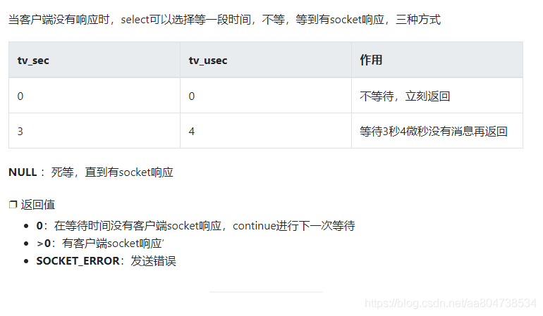
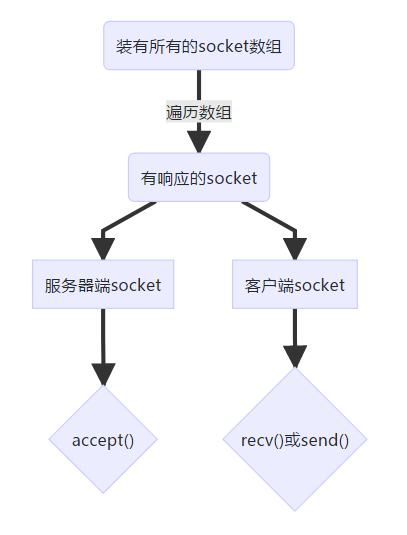

## 项目相关

##### 项目介绍：

是一个在github上找的开源的小项目，主要是为了学习服务端与客户端的通讯，用线程技术将不同的功能分开完成。通过建立一个socket,（bind()端口，listen()端口，accept(),send()receive() close()等步骤），然后是加一些缓冲机制，逐步完善的一个过程。

面试官您好，我叫岳壮，目前硕士就读于西安理工大学精密仪器系光电研究所。

目前我熟悉c++语言，TCP/IP计算机网络，数据结构与算法等计算机相关知识，在学习期间从零开始搭建一个客户端与服务端，用select实现持续监听，用不同的线程将任务分离，接收信息方面使用了缓存队列，解决了一些沾包组包的问题，最终在本机上测试1000个客户端与服务端通讯，带宽跑到500M

我性格开朗，能与他人很好的团队合作，做事善始善终，自己能搜集资料学习并解决问题，具备较强的学习能力。

我热爱客户端，一款好的app可以提高生活效率，改变生活方式，提高幸福感，我想投身其中，成为一名客户端开发工程师。

#####  建立socket

用socket()函数建立socket，选择通讯模式，数据模式等等。

1. ##### 难点 发送自定义的数据包

stuckt DataPackage{

int age;

char name[32];

}

选择数据流传输模式

int nlen=recv(_sock,recevBuf,128,0);

DataPackage* Msg=(DataPackage *)nlen;

**使用强制转换，将接收的数据流转化为结构体**,客户端与服务端的数据包结构体要相同

###### 遇到问题：当输入的命令出错时，无法获得想要的信息

**解决方案：**采用了规范的网络数据结构报文格式，在包头中申明cmd和包体的数据长度，**并且cmd是有限数量且已知的故用enum（枚举）**：

```c++
enum CMD
{
	CMD_LOGIN,
	CMD_LOGOUT,
	CMD_ERROR
};
struct DaraHeader{
	char userName[32];
    char PassWord[32];
}
//接收语句修改
DaraHeader header = {};
int nLen = recv(_cSock,(char*)&header,sizeof(header),0);//将结构体强制转换为字符串，并且使用引用，实现传值
```

2.**遇见问题**：转化成包头包体规定数据结构以后，client每次需要先发送包头，然后再发送数据，过程繁琐，可能会出错，故需要将其改进为一次性收发

**解决方案：**

将dataHead作为基类，其他的命令结构体继承基类，使用构造函数对其进行初始化,发送数据时即可直接一次性发送。

```c++
struct Login：DataHeader
{
	login(){
		dataLength=sizeif(login);
		cmd=CMD_LOGIN;
	}
	char userName[32];
	char PassWord[32];
};
```


##### select函数

```c++
select(nfds,fd_set*read,fd_set*write,fd_set*exceptfds, struct timeval *timeout)
 //nfds 最大描述符+1
//fd_set read 可读套接字集合
//fd_set write 可写套接字集合
//fd_set except 其他套接字集合
//const timval*timeval 通过这个参数可将select变成非阻塞模式，即当在这些集合中未查询到所需描述符，他就会直接返回。
```

##### select的返回值

```c++
int ret=select(_socket+1,&fdRead,&fdWrite,&fdExcep,timeout)
```

select系统调用的作用是帮我们找到可读或者可写或者有异常出现的描述符（fd）。

**关于select()的返回值：**失败返回-1，当有数据可读时会返回>0，超过时间返回0。所以如果ret>1说明存在准备就绪的描述符。

select在linux中的最大描述符是1024个，要突破select模型，就需要采用多线程技术，在每个线程中使用一个select模型，那么最大连接数就等于线程数*1024 FD_SETSIZE宏可以改，改大也可以的。

##### 关于Timeout参数：



- NULL ---select阻塞模式：一定等到监视文件描述符集合中某个文件描述符发生变化为止
- 0---select非阻塞模式：不管文件描述符是否有变化，都立刻返回继续执行
- 其他---定时阻塞模式：即select在timeout时间内阻塞，超时时间就返回0

## 如何使用select：

### 理解select

**什么是io复用？**

它是内核提供的一种同时监控多个文件描述符状态改变的一种能力；例如当进程需要操作多个IO相关描述符时（例如服务器程序要同时查看监听socket和大量业务socket是否有数据到来），需要内核能够监控这许多描述符，**一旦这些描述符有就绪（或者状态改变了）就告诉主动告诉进程哪些描述符已经就绪，这样站在进程的角度，就不需要挨个的查看每个描述符是否就绪。**

**总结：**IO复用可以判断[套接字](https://so.csdn.net/so/search?q=套接字&spm=1001.2101.3001.7020)上是否存在数据，或者能否向一个套接字写入数据。目的是防止应用程序在套接字处于锁定模式时，调用recv（或send）从没有数据的套接字上接收数据，被迫进入阻塞状态。

**select是实现IO复用的一种系统调用**，目的是：**在**一段**指定时间内**，**监听**用户感兴趣的**文件描述符上**的可读、可写和异常事件，**帮助**系统调用者寻**找已经就绪的设备**。poll和select应该被归类为这样的系统调用。

### *select使用过程（重要）

**select()功能：**监听描述符集合的状态，如果描述符中没有就绪的，并且还在timeout规定时间内，等待，等待结束，select将未准备就绪的fd从集合中清除，在准备就绪的描述符（fd）位置标记为1。

解释：select通过轮询来检测各个集合中的描述符（fd）的状态，如果描述符的状态发生改变，则会在该集合中设置相应的标记位；如果指定描述符的状态没有发生改变，则将该描述符从对应集合中移除。因此，select的调用复杂度是线性的，即O(n)。

**select工作流程：**

select,删除未准备就绪的描述符，标记已经准备就绪的描述符，并返回>0的数表示此种情况，用FD_ISSET(fd,fd_set),确定哪个fd准备就绪，然后对其进行处理。

- 编码流程

  定义描述符集

-   

- 清空描述符集

- ​      

  设置指定的描述符并获取最大的描述符值+1

- ​    

  等待描述符就绪

  判断已就绪的描述符，并做对应处理

  **本项目代码解释：**

**1：用FD_ZERO宏来初始化我们感兴趣的fd_set。**

```c++
		//感兴趣的fd_set，分别为可读，可写，和报异常
		fd_set fdRead;
		fd_set fdWrite;
		fd_set fdExp;
		FD_ZERO(&fdRead);//清零
		FD_ZERO(&fdWrite);
		FD_ZERO(&fdExp);
		
```

2：用FD_SET宏来将套接字句柄分配给相应的fd_set。

```c++
		//将服务端的socket放入队列
		FD_SET(_sock, &fdRead);
		FD_SET(_sock, &fdWrite);
		FD_SET(_sock, &fdExp);
		//将客户端的socket放入队列
		for (int n = (int)g_clients.size()-1; n >= 0 ; n--)
		{
			FD_SET(g_clients[n], &fdRead);
		}
		//完成将所有的socket放入队列
```

如果想要检查一个套接字是否有数据需要接收，可以用FD_SET宏把套接接字句柄加入可读性检查队列中

3：调用select函数。

```c++
		timeval t = {0,0};//设置为非阻塞模式
		int ret = select(_sock + 1, &fdRead, &fdWrite, &fdExp, &t);
```


如果该套接字没有数据需要接收，select函数会把该套接字从可读性检查队列中删除掉，所以留下的就是可以接受的（准备就绪的）

4：用FD_ISSET（检查描述符是否在队列中）对套接字句柄进行检查。当检查出来还在，那说明这个描述符需要read,在socket通信中就是可以accept(),此时调用io不会被阻塞。

```c++
		//判断select是否成功
		if (ret < 0)
		{
			printf("select任务结束。\n");
			break;
		}
		if (FD_ISSET(_sock, &fdRead))
		{
			FD_CLR(_sock, &fdRead);
			// 4 accept 等待接受客户端连接
			sockaddr_in clientAddr = {};
			int nAddrLen = sizeof(sockaddr_in);
			SOCKET _cSock = INVALID_SOCKET;
			_cSock = accept(_sock, (sockaddr*)&clientAddr, &nAddrLen);
			if (INVALID_SOCKET == _cSock)
			{
				printf("错误,接受到无效客户端SOCKET...\n");
			}
			g_clients.push_back(_cSock);
			printf("新客户端加入：socket = %d,IP = %s \n", (int)_cSock, inet_ntoa(clientAddr.sin_addr));
		}
```

逻辑上的过程：




##### 线程

线程库：#include<thread>

std::thread t1(函数)

线程传入的参数是一个函数，能实现，开启一个线程，来处理这个函数。

##### 技术栈：

多线程，监听用一个线程，如果有客户端连接了，就开一个线程来服务这个客户端。然后用一个动态数组来管理这个客户端的socket。然后与客户端通信这方面发送消息是封装为一个方法，然后安排给任务线程处理，消息接收建立了一个缓冲区，每次是将缓冲区全部读完，其中涉及到一些组包的问题，然后就对信息进行处理，也是用任务线程，内存管理主要是线程和客户端soket的管理。

##### 学到了什么：


##### 难点：


##### 测试

用的是客户端服务端通讯时候的带宽和传递字节数来看的，在任务管理器cpu性能这块可以看到。

1000个连接大概4-500M 10000个连接是1G

###### 线程数增加

线程数和和cpu有关系应该

###### select

select和epoll的区别：

select 监听文件描述符，他会将fd_set从用户态拷贝到核心态，然后会遍历整个数组，直到有事件触发，然后从核心态回到用户端，用户就可以对相关fd进行操作。

epoll

epoll_cteat时，现在文件系统建一个file结点，在内核的cache里建了一个红黑树来储存epoll_ctl传来的socket。然后建了一个List链表储存，准备就绪的事件。

epoll_ctl 完成 给红黑树传入一个socket 然后，给内核的中断处理程序注册一个回调函数，当句柄中断发生，就将事件放入list链表中。

epoll_wait

如果list链表中有句柄，返回即可，没有则sleep，等到一定时间自动返回。就算监控大量的句柄，每次也只返回少量的句柄

总结：epoll拥有注册响应机制和红黑树查找，所以效率高，消耗小，selet需要从用户态拷贝到内核态，还需要遍历，效率低。

###### 百度二面

1. 内存泄漏
2. 内存泄漏如何解决
3. 野指针
4. 如何读取一个大的文件
5. 单例模式（设计模式欠缺）优缺点

###### 学习了什么

王道考研的 数据结构与算法 计算机网络 操作系统

本科的时候学过c++  网上看了几百集的c++教学视频，

看过 c++ primer 

##### 个人优点

1.确定了目标不会随意更改，研二上半年我在考虑找什么工作的时候，调查了与我课题相关的硬件和软件两个方面，结合自己的兴趣爱好，还有体验的过程，最终确定


